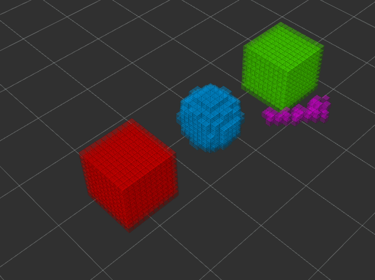
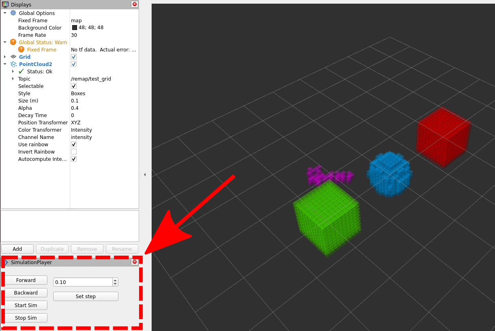
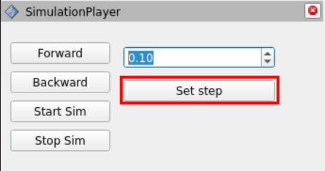
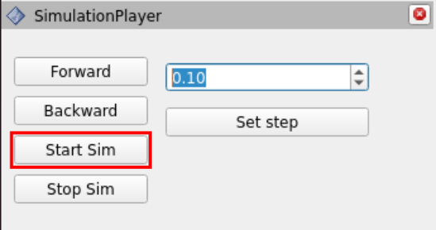

VDB-based Spatially Grounded Semantics for Interactive Robots
=============================================================

Hi! Here you can find the description of how to run the
demo we have prepared for this contribution. This is part of
the HRI 2025 submission "VDB-based Spatially Grounded Semantics for Interactive Robots."
For this reason, this repo and all the other repos involved
in the submission are currently anonymized.

Requirements
------------

In order to run the demo, we invite the user to download the
following (anonymized) GitHub repos:

- [`representation_plugins`](https://anonymous.4open.science/r/representation_plugins/README.md)
- [`representation_manager`](https://anonymous.4open.science/r/representation_manager/README.md)
- [`reg_of_space_server`](https://anonymous.4open.science/r/reg_of_space_server/README.md)
- [`vdb2pc`](https://anonymous.4open.science/r/vdb2pc/README.md)
- [`simulation_player`](https://anonymous.4open.science/r/simulation_player/README.md)

In the future, the download of all required repos will be handled
directly from this repo through git submodules.
However, due to the anonymization process, this is not possible at the moment.

Demo
----

The demo showcases the structures and algorithms described in the paper submission.
It includes two `reMap` plugins that dynamically generate and delete multiple abstract
semantic instances on the fly. The primary goal of the demo is to demonstrate
the performance of the architecture when handling multiple instances that may overlap,
requiring dynamic management of the indexes associated with the semantic instances.



In the demo, different colors are associated with different IDs in the semantic instances lookup table.
The simulation shows how new entries are created in the lookup table whenever
intersections between multiple instances occur,
and how the IDs are restored to their original values for all voxels
once the objects are isolated again.


Building the demo
-----------------

1. In case this repo is still anonymized, download the required repos listed above.
2. Clone (or download, if anonymized) this repo.
3. Change folder, moving inside of the one created by cloning (or extracting from 
	the anonymous version download) this repo: `$ cd hri_2025_submission`.
4. Clone [`OpenVDB`](https://github.com/AcademySoftwareFoundation/openvdb)
	from github in this folder: `$ git clone https://github.com/AcademySoftwareFoundation/openvdb.git && cd openvdb && git checkout v11.0.0 && cd ..`
5. Create a new `src` folder: `$ mkdir src`.
6. Move inside `src` the five previously cloned/downloaded folders required to run the demo.
	At this point, you should have the following folder structure:
	```console
		hri_2025_submission
		├── Dockerfile
		├── docker_script.sh
		├── ETHICAL_STATEMENT.md
		├── hri_2025.rviz
		├── LICENSE
		├── MAINTENANCE_NOTE.md
		├── openvdb
		├── README.md
		├── res
		│	├── hri_2025_demo.gif
		│	├── rviz_simulation_simulation_player.png
		│	├── simulation_player_start_sim.png
		│	└── simulation_player_step.png
		├── run_simulation.sh
		└── src
		    ├── reg_of_space_server
		    ├── representation_manager
		    ├── representation_plugins
		    ├── simulation_player
		    └── vdb2pc
	```
7. Build the demo docker image: `$ docker build . -t vdbsemantics:vdbsemantics`.

Running the demo
----------------

1. Run the docker using the provided utility script: `$ ./docker_script.sh -it --name vdbsemantics vdbsemantics:vdbsemantics bash`.
2. Run the simulation script `$ bash run_simulation.sh`, starting:
	- The `representation_manager` node and the `reg_of_space_server` node.
	- Rviz, already set to visualize the simulation results (including the `simulation_player` panel).
3. Execute the docker container in another terminal: `$ docker exec -it vdbsemantics bash`.
4. Use the second terminal to start/stop plugins. For instance:  
	`ros2 service call /add_plugin representation_manager/srv/AddPlugin "plugin_name: 'PluginBoxTest'
	threaded: false"`.
	**Important:** rather than copy-pasting this instruction, use tabbing to autocomplete the plugin name.
	This will enforce the service message to have the correct format.
	**Important:** multithreading behaviour not implemented yet.
5. By default, the demo runs continously at 20 Hz. Through the `simulation_player` you can start, stop and advance
	by a custom step-size (in seconds) the simulation. 

	

	For this, set the desired simulation step through the dedicated
	box and propagate it to the whole architecture by clicking on `Set Step`:

	

	Then, by clicking on `Start Sim`, the demo will freeze:

	

	At this point, by using the `Forward` and `Backward` buttons, you can visualize step by step the
	advancement of the different instances, and how new IDs are added and removed via the 
	different voxel colors. 